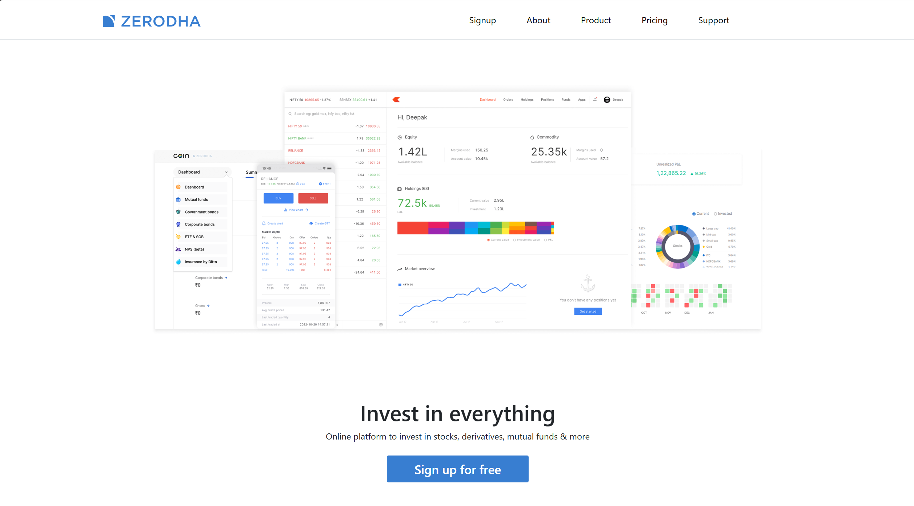
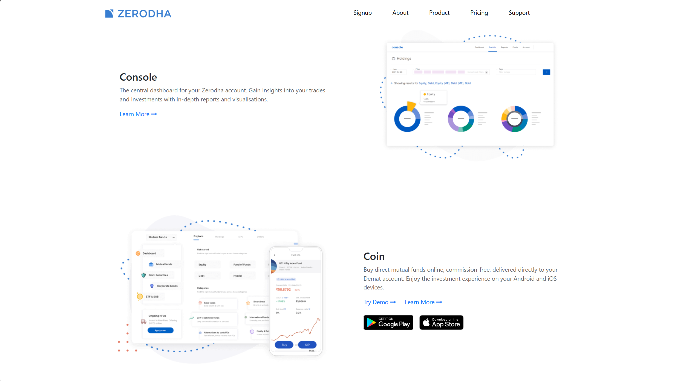
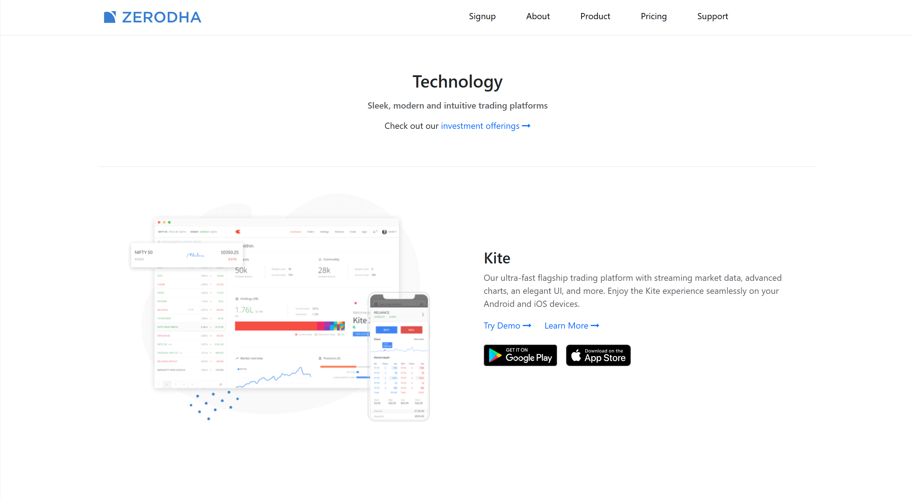
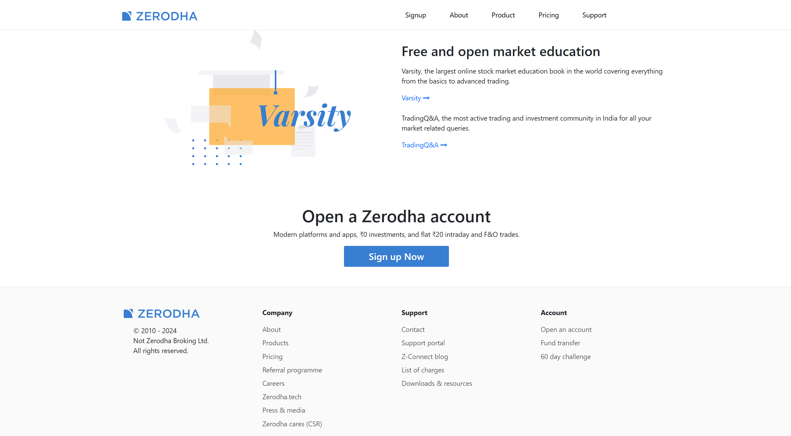

# Zerodha Clone - Frontend Trading Dashboard


## Features :

- **Component-Based Architecture:** Built using ReactJS components for modularity and reusable UI elements.  
- **React Hooks:** Utilized `useState` and `useEffect` for state management and handling side effects efficiently.  
- **Cloud Deployment:** Hosted on **AWS Amplify** for seamless cloud access and high availability.

---

## Technologies Used :

- **Frontend:** ReactJS, HTML5, CSS3, Bootstrap  
- **State Management:** React Hooks (`useState`, `useEffect`)  
- **Deployment:** AWS Amplify  

---

## Visuals :

<p float="center">
  
  
  
  
</p>

---

## Getting Started :

To run this project locally, follow these steps :

**1. Clone the repository :**
```bash
git clone https://github.com/PranavNikam-15/Zerodha-Clone.git
```

**2. Navigate to the project directory :**
```
cd Zerodha-Clone/frontend
```


**3. Install dependencies :**
```
npm install
```

**4. Start the development server :**
```
npm run dev
```

**5. Open your browser and visit :**
```
http://localhost:5173
```

---

## Deployment :

- This project is deployed on AWS Amplify :
   
   [🔗 View Live Demo](https://main.d3fscitje0qvgw.amplifyapp.com)